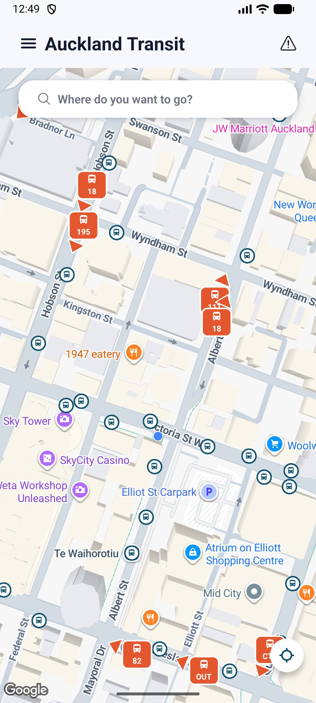
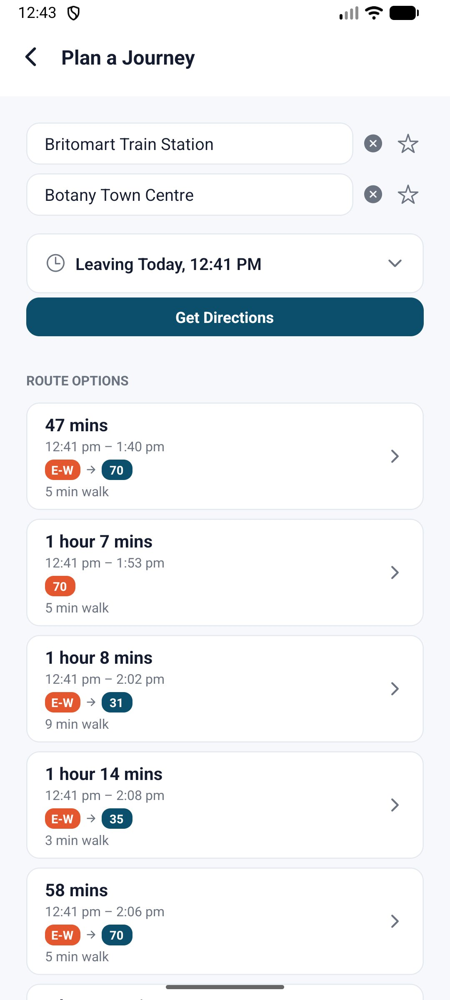
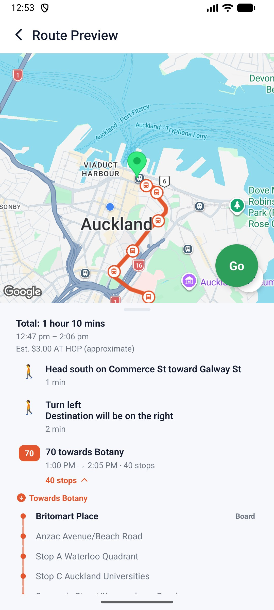

# Auckland Transit

A personal, from-scratch alternative to Auckland Transport's official app — live vehicle tracking, journey planning with real-time GPS step tracking, background-surviving trip notifications, and an offline-first schedule database, built solo with Expo/React Native + TypeScript.

Built against Auckland Transport's public GTFS + GTFS-Realtime APIs and Google's Routes/Places APIs. Mobile only, no web build — built and tested on Android; iOS is configured but untested (see Known limitations).

## Screenshots

<p float="left">
  
  
  
</p>

## Why I built this

The official app buries notification settings behind several taps and sends recurring alerts that are hard to fully turn off, and its stop map doesn't make it obvious which side of the road a stop actually sits on. I wanted something opt-in by default, with exact stop locations, and — since I was building it myself — the freedom to add features I actually wanted (like live GPS tracking during a journey, and a lock-screen notification that tells you when to get off).

## Features

- **Live map** — every bus, train, and ferry currently running, updating in real time, with mode-specific markers that point the way each vehicle is heading. Tap a vehicle for its next stop, delay status, and its route drawn on the map.
- **Journey planning** — multiple route options via Google's Routes API, each with duration, line badges, and walking time. Departure time is adjustable via a custom scrollable date/time picker, and From/To stay editable on the results page itself.
- **Live journey tracking** — once you start a route, your position is matched to the correct step in real time (GPS-based, with a scheduled-time fallback), the map re-centers automatically, and a persistent notification keeps tracking even if the app is closed or the phone is locked. Each leg's own stop list is shown top to bottom, with the stop you're at and the direction of travel highlighted live — stops already passed fold behind a tap-to-expand summary instead of disappearing.
- **Boarding/alighting alerts** — a vibrating notification fires when your vehicle has just arrived at the stop before yours, then again right as you reach your own stop — driven by your live position along the route, not just a fixed time before the scheduled arrival.
- **Stop details** — live + scheduled departures merged into one list, plus any active service alerts for that stop.
- **Favourites** — save stops, places, or whole from→to trips for one-tap re-search.
- **Offline schedule data** — scheduled departures and route path geometry work without a network call, backed by a compact SQLite database built from AT's static GTFS feed (see below — AT's live API doesn't expose this data at all).
- **Experimental fare estimation** — AT publishes no machine-readable fare data, so this reverse-geocodes each leg and matches it against AT's public fare-zone boundaries, clearly flagged as an estimate.
- **Dark mode** and **English/Korean localization**, throughout.
- **Over-the-air updates** — JS-only changes ship instantly via EAS Update without needing a new app-store-style build.

## Tech stack

- **Expo (React Native + TypeScript)**, SDK 57, EAS Build / EAS Update
- **React Navigation** (native-stack)
- **react-native-maps** (Google Maps SDK)
- **expo-location** + **expo-task-manager** — background GPS tracking via an Android foreground service
- **expo-notifications** — persistent + one-shot local notifications
- **expo-sqlite** — on-device queries against a bundled, pre-built schedule database
- **AsyncStorage** — local persistence (favourites, active journey, notification dedup)
- Auckland Transport's GTFS + GTFS-Realtime APIs, Google Routes API + Places API (New)

## Notable engineering challenges

A few problems that took real digging to solve properly, condensed here — the full blow-by-blow (every bug report, every root cause) lived in this README during development and is preserved in git history.

- **No official schedule or route-shape API.** AT's REST API has no `stop_times` or `shapes` endpoints at all (confirmed by hitting them live — all 404). I wrote a Python build script (`scripts/build-gtfs-db.py`) that turns AT's separately-downloadable static GTFS zip into a single compact SQLite database — normalizing repeated route/headsign/stop text into small lookup tables and packing times/coordinates as integers took a naive 161 MB dump down to 58 MB, bundled into the app and queried entirely on-device via `expo-sqlite`, no network call needed for scheduled departures or route geometry.
- **Journey tracking that survives the app being killed.** Starting a journey keeps a live, ongoing notification updated even with the screen off, via `expo-task-manager` and an Android foreground service. Getting Android's notification behavior right took real iteration: a HIGH-importance channel was popping a heads-up alert on every ~15s refresh, so it's now split into a LOW-importance ongoing-status channel and a separate HIGH-importance channel used only for genuine boarding/alighting alerts — with AsyncStorage-backed dedup so a background task (which has no access to React state or memory of what it already fired) never re-alerts for the same event.
- **GPS-based step matching, with a schedule fallback.** Live tracking primarily matches your GPS position to the closest transit step's own polyline (point-to-segment distance, projected to local meters), only falling back to comparing against scheduled times when no position is confidently close — and filters out low-accuracy fixes that could otherwise land within range of the wrong step purely by chance on a long multi-leg route.
- **Native map view staleness.** `react-native-maps` on Android sometimes silently no-ops a redraw when a `Polyline` or custom `Marker`'s props jump straight from one non-empty value to another — a real bug that showed up as routes not re-highlighting on reselection. Fixed by clearing to an empty value for one frame (`requestAnimationFrame`) before setting the real one, forcing two distinct native updates instead of one the view could skip.
- **A heading arrow that looks right at every angle.** A pointer fused directly onto a vehicle's badge reads fine at the top or bottom but looks visibly wrong at a diagonal — confirmed by rendering all 16 compass headings side by side rather than eyeballing a couple. Fixed by detaching the arrowhead a fixed distance off the badge's own edge instead, using a signed-distance function to locate that edge at any angle so the gap reads as constant all the way around.
- **Same-name stops that aren't the same stop.** A station where two directions of the same line meet (e.g. Glen Innes, where the Eastern Line's two directions cross) has a separate AT stop ID per platform, sometimes only metres apart — closer together than any reasonable coordinate-matching tolerance. Matching Google's board/alight coordinate to a single "nearest" AT stop before knowing which trip it actually was picked the wrong platform on a real Auckland route, silently resolving zero stops for that leg. Fixed by keeping every stop within range as a candidate and checking a matched trip's own stop sequence against the whole set, so whichever platform that specific trip actually uses is the one that's found.
- **OTA update lag during fast iteration.** `expo-updates` only applies a downloaded update on the *next* cold start by default — during active testing this made fixes look like they hadn't landed, when really the tester was always one publish behind. `App.tsx` now checks, fetches, and reloads synchronously before rendering, so a single close-and-reopen always lands on the latest published update.
- **Fare estimation from data that doesn't officially exist.** AT publishes no fare API and no downloadable fare-zone map (confirmed against the Mobility Database feed listing and both APIs in use). Fares are estimated by reverse-geocoding each leg's boarding/alighting stop and matching the resulting suburb against AT's own zone-boundary descriptions, hand-transcribed from their public fares page — deliberately labeled "(approximate)" in the UI rather than presented as authoritative.

## Known limitations

- **Mobile only** — no web build; `react-native-maps` doesn't support it, and it was never a goal.
- **Built and tested on Android only** — the app is configured for iOS too (bundle identifier, permissions, plugins are all in `app.config.js`), but a real iOS build requires a paid Apple Developer Program membership to install on a physical device, which this project hasn't set up. Untested on iOS as a result.
- **Route highlights, per-leg stop lists and scheduled departures depend on a bundled timetable snapshot.** AT re-issues its trip IDs whenever it publishes a new schedule, so the snapshot can fall out of step with the live feed well before its stated end date. This bit for real: a check of every live vehicle against the bundled database found only 35% of their trips (so only 35% could show a route), until it was rebuilt from a fresh feed (100%). Rebuilding is `scripts/build-gtfs-db.py` on AT's current `gtfs.zip` — worth repeating whenever AT publishes a new feed. The hamburger menu warns when the feed is close to expiring, but that date alone doesn't catch this drift.
- **Fare estimates are approximate**, not official pricing — see above.
- **No automated test suite** — correctness was verified through real-API testing (with live keys, not mocks) and manual device testing throughout development, not unit/integration tests.

## Getting started

### 1. Get an Auckland Transport API key

1. Go to the [AT Developer Portal](https://dev-portal.at.govt.nz/) and sign up (free).
2. Subscribe to a product from the **Products** page (free tier: 600 calls/minute, 35,000 calls/week).
3. Copy your subscription key.

### 2. Get a Google API key

AT's API has no route-planning, address-lookup, or map-tile endpoint, so two Google APIs cover that:

1. Create a project in the [Google Cloud Console](https://console.cloud.google.com/) and enable billing (required even for the free monthly credit).
2. Enable the **Routes API**, **Places API (New)**, and **Maps SDK for Android**.
3. Create an API key under **APIs & Services → Credentials**.

Both APIs share the standard $200/month free credit; autocomplete is free, each "Get Directions" call costs a small fraction of a cent. For personal use this should stay at $0, but it's pay-as-you-go past the free credit.

### 3. Configure and run

```bash
cp .env.example .env
# fill in both keys in .env
npm install
```

This app needs a **custom development build**, not the plain Expo Go app (`react-native-maps` isn't available in Expo Go). One-time setup:

```bash
npx eas login
npx eas env:create --name EXPO_PUBLIC_AT_API_KEY --value your-at-key --scope project --visibility sensitive --environment development preview production
npx eas env:create --name EXPO_PUBLIC_GOOGLE_DIRECTIONS_KEY --value your-google-key --scope project --visibility sensitive --environment development preview production
npx eas build --profile development --platform android
```

Install the resulting build on your phone, then day-to-day:

```bash
npm start
```

Open the installed app on your phone — it connects to the Metro server automatically, and most changes (screens, components, logic, styles) show up instantly via Fast Refresh. A rebuild is only needed again if you add a native dependency or change native config in `app.config.js`.

## Project structure

```
src/
  components/    Reusable UI: live map, route-preview map, vehicle heading-arrow badge, per-leg
                 stop list, draggable sheets, favourites panel, place autocomplete input, time
                 picker, side menu, animated buttons, etc.
  context/       Favourites (stops/places/trips), recents, home address, read/dismissed alerts,
                 settings, theme — AsyncStorage-backed
  hooks/         useCountdown (a synced "updates in Ns" countdown shared by live-vehicle cards),
                 useLegStops (the stops each leg of a route passes through)
  i18n/          Translation table + hook (also usable outside React, for the background task)
  screens/       Home, Favorites, AddFavorite, StopDetail, Settings, About, JourneyPlanner,
                 ChooseOnMap, MyTrips, SearchStops, Alerts, SetHomeAddress
  services/
    atClient.ts          Low-level fetch wrapper for AT's API (adds the subscription key header)
    gtfs.ts              Stop search, route lookup, trip headsign lookup (live AT REST API)
    gtfsStatic.ts        Scheduled departures + route shapes, queried from the bundled SQLite db
    realtime.ts          Live departures (GTFS-realtime trip updates), cached and batched
    vehicles.ts          Live vehicle positions for the map (GTFS-realtime vehicle locations)
    alerts.ts            Active service/disruption alerts, filtered by stop or route
    directions.ts        Google Places autocomplete + Routes API transit directions
    journeyTracking.ts   GPS-position-based step matching, with schedule-time fallback
    routeStops.ts        Every stop a transit leg passes through (cached), from the bundled timetable
    legProgress.ts       How far along a leg a rider is in terms of its stops (pure, no Expo imports)
    alightStage.ts       Decision rules for the get-off alert: "next stop" / "at your stop" (pure)
    journeyNotification.ts  Background location task, journey notification, boarding/get-off alerts
    activeJourney.ts     Persists the in-progress journey so it survives the app being closed
    liveVehicleMatch.ts  Every live vehicle running on a journey's route numbers
    fareZones.ts         Experimental fare estimation from reverse-geocoded fare zones
    legColors.ts         Shared per-leg color palette (map + step list use the same colors)
    location.ts          expo-location wrapper
    markerIcon.ts, departures.ts, mockData.ts, notifications.ts
  theme.ts, mapStyle.ts, types.ts
scripts/
  build-gtfs-db.py   One-time build step: AT's static GTFS zip -> assets/gtfs.db
  generate-icons.py  Draws the app icon set (iOS, Android adaptive/themed, notification) from geometry
assets/
  gtfs.db            Bundled pre-built SQLite database, queried by gtfsStatic.ts
  icon.png, android-icon-*.png, notification-icon.png   Generated by scripts/generate-icons.py
index.ts             Entry point — registers the background location task before the app mounts
App.tsx              Navigation shell + startup update-check
app.config.js        Expo config — native plugins, permissions, package/bundle IDs
metro.config.js      Lets Metro bundle assets/gtfs.db as a binary asset
eas.json             EAS Build profiles (development/preview/production)
```

## License

MIT — see [LICENSE](LICENSE).
